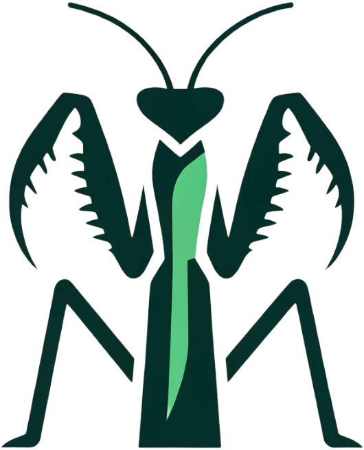

## Talks

- [2024-02-19] [\[slides\]](https://docs.google.com/presentation/d/1-0uYzlR_-hUpgdfEksFWb65l0UouJ0W_/edit?usp=sharing&ouid=112776303426789186559&rtpof=true&sd=true) Invited talk at Vector NLP workshop about [TIGERScore](https://tiger-ai-lab.github.io/TIGERScore/). 

- [2023-07-27] [\[slides\]](https://docs.google.com/presentation/d/1UvTYEjIjpPGjrvBxtEmAtC06N-7xFFY9/edit?usp=sharing&ouid=112776303426789186559&rtpof=true&sd=true) Invited talk at AutoGPT reading group about [LLM-Blender](https://yuchenlin.xyz/LLM-Blender/). 

---

## Blogs
- [2024-04-14]  [Mantis: Interleaved Multi-Image Instruction Tuning](https://tiger-ai-lab.github.io/Blog/mantis).

---

## Services
**I have served as a reviewer for the following conferences**

- ACL ARR (2024)
- NeurIPS (2024)
- ICLR (2024)
- TMLR
- AISTATS (2025)

<!-- For now, this page is assumed to be a static description of your courses. You can convert it to a collection similar to `_projects/` so that you can have a dedicated page for each course.

Organize your courses by years, topics, or universities, however you like! -->
