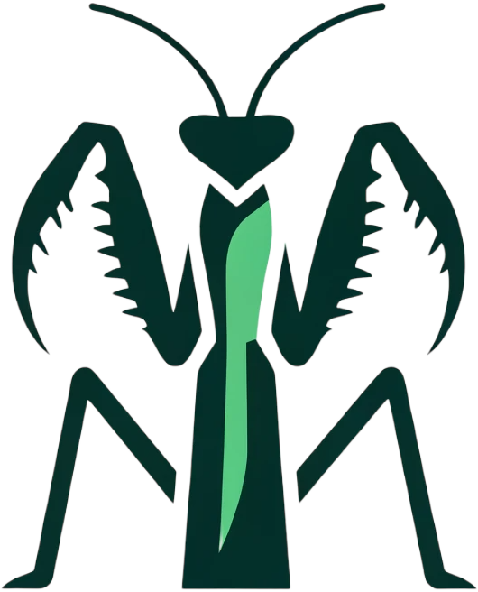

## Talks

- [2024-02-19] [\[slides\]](https://docs.google.com/presentation/d/1-0uYzlR_-hUpgdfEksFWb65l0UouJ0W_/edit?usp=sharing&ouid=112776303426789186559&rtpof=true&sd=true) Invited talk at Vector NLP workshop about [TIGERScore](https://tiger-ai-lab.github.io/TIGERScore/). 

- [2023-07-27] [\[slides\]](https://docs.google.com/presentation/d/1UvTYEjIjpPGjrvBxtEmAtC06N-7xFFY9/edit?usp=sharing&ouid=112776303426789186559&rtpof=true&sd=true) Invited talk at AutoGPT reading group about [LLM-Blender](https://yuchenlin.xyz/LLM-Blender/). 

---

## Blogs
- [2024-04-14]  [Mantis: Interleaved Multi-Image Instruction Tuning](https://tiger-ai-lab.github.io/Blog/mantis).

---

## Students I Mentored / Worked With

- [Yishan Li](https://scholar.google.com/citations?user=5PfpWbAAAAAJ&hl=en) (B.S.: THU) -> OpenBMB
- [Xuan He](https://scholar.google.com/citations?user=G0_RcM4AAAAJ&hl=en) (B.S.: THU) -> UIUC PhD
- [Wyett Zeng](https://seas.harvard.edu/person/wyett-zeng) (B.S.: UWaterloo) -> Harvard M.S.
- [Jialin Yang](https://scholar.google.com/citations?user=oxululUAAAAJ&hl=en) (B.S.: UWaterloo) -> Dartmouth PhD
- [Zhuofeng Li](https://zhuofeng-li.github.io/) (TAMU PhD)
- [Yuxuan Zhang](https://www.cs.ubc.ca/~reacher/) (UBC PhD)
- [Yi Lu](https://eigentom.github.io/) (M.S.: UofT)
- [Chi Ruan](https://scholar.google.com/citations?user=cMVAjpEAAAAJ&hl=en) (B.S.: Ottawa)
- [Shenzhe Zhu](https://shenzhezhu.github.io/) (B.S.: UofT)

---

## Academic Service

I have served as a reviewer for the following venues:

- ACL ARR (2024, 2025)
- NeurIPS (2024, 2025)
- ICLR (2024)
- TMLR (2024, 2025)
- AISTATS (2025)
- AAAI (2025)
